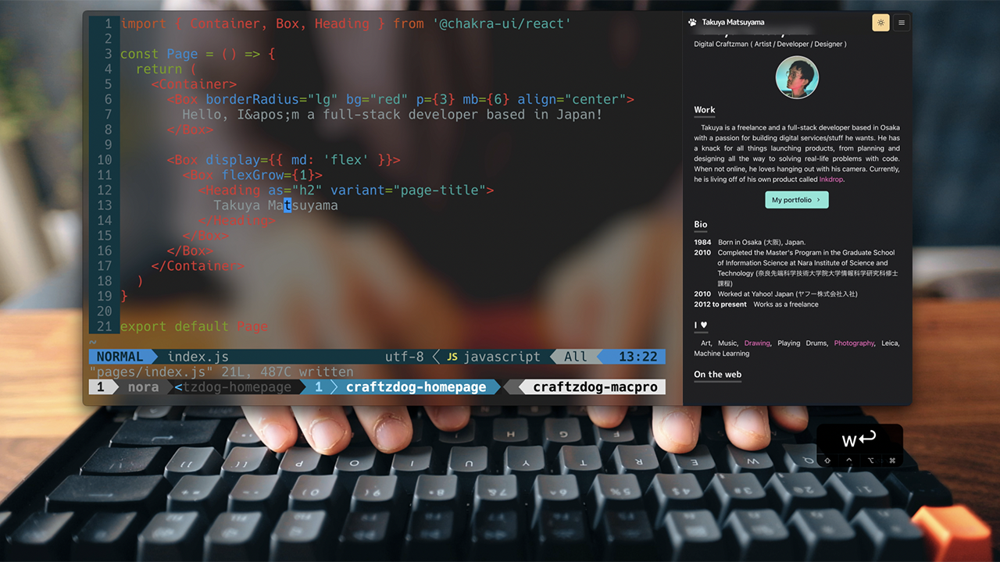

# Credits to Takuya's Homepage
[https://www.craftz.dog/](https://www.craftz.dog/)

## Tutorial
<a href="https://www.youtube.com/watch?v=bSMZgXzC9AA"></a>

## Christian Halim
<p align="center">
  <a href="https://www.linkedin.com/in/haneure/"></a> </br>
</p>
I am a computer science student at Multimedia Nusantara University, currently on 6th semester. My GPA is 3.84
I mainly code on Javascript and Java as a Back End Developer.
I am striving to be a Full Stack Developer who can adapt to many languanges with ease.
Please take a while to look at my recent projects on my homepage.

## Stack
- [Next.js](https://nextjs.org/) - A React framework with hybrid static & server rendering, and route pre-fetching, etc.
- [Chakra UI](https://chakra-ui.com/) - A simple, modular and accessible component library for React
- [Three.js](https://threejs.org/) - 3D library for JavaScript
- [Framer Motion](https://www.framer.com/motion/) - An animation library for React

## Project structure

```
$PROJECT_ROOT
│   # Page files
├── pages
│   # React component files
├── components
│   # Non-react modules
├── lib
│   # Static files for images and 3d model file
└── public
```
---
